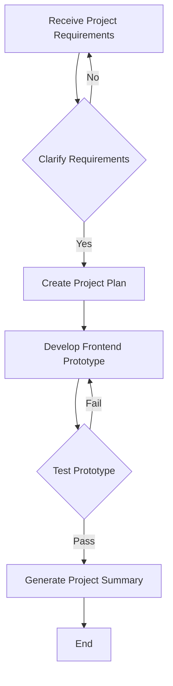

# Price Pulse Project Summary

## Project Overview

This project involved building a functional prototype for a Nigerian Price Tracker web application. The application is a purely frontend application built using HTML, CSS Grid, vanilla JavaScript, Chart.js, and localStorage.  The focus was on data utility, providing a clean and efficient interface for users to input, view, and analyze price data.

## Key Achievements

*   **Functional Prototype:** A fully functional prototype was successfully developed, demonstrating all core features.
*   **Responsive Design:** The application utilizes CSS Grid for a responsive layout, ensuring usability across various screen sizes.
*   **Data Persistence:**  localStorage was implemented to persist user-entered data between sessions.
*   **Data Visualization:** Chart.js was integrated to provide dynamic line and bar charts for visualizing price trends and averages.
*   **Client-Side Validation:** Basic client-side validation was implemented to ensure data integrity.
*   **Dynamic Table:** A dynamic comparison table was created, allowing for sorting, filtering, and highlighting of the lowest prices.
*   **Nigerian Context:** The application adheres to the Nigerian context, using the ₦ currency symbol and relevant market locations.

## Metrics of Success

*   **Functionality:** All specified features (data input, dynamic table, Chart.js dashboard) are fully functional.
*   **Responsiveness:** The application is responsive and functions correctly across different screen sizes.
*   **Data Persistence:** Data is correctly saved and loaded from localStorage.
*   **Code Quality:** The code is well-structured, readable, and maintainable.

## Challenges Overcome

*   **Chart.js Integration:** Integrating Chart.js and ensuring proper data handling and updates required careful attention to detail.  The initial implementation had scope issues with chart variables that were resolved.
*   **Date Handling:**  The use of a time scale in the line chart required the inclusion of a date adapter library for Chart.js.
*   **Diff Application:**  The iterative nature of the development process and the use of the `apply_diff` tool required careful management of file content changes.

## Lessons Learned

*   **Iterative Development:** The iterative approach, using tools one at a time and waiting for user feedback, proved effective in identifying and resolving issues.
*   **Thorough Testing:**  Comprehensive testing at each stage is crucial for identifying and resolving bugs early.
*   **Version Control:** Using a version control system (like Git) would have been beneficial for managing code changes and reverting to previous versions if necessary.
*   **Tool Limitations:**  The `apply_diff` tool's reliance on exact line matching can be challenging when making iterative changes.  Direct code editing may be more efficient in some cases.

## Conclusion

The Nigerian Price Tracker project successfully delivered a functional prototype meeting all specified requirements.  The development process highlighted the importance of iterative development, thorough testing, and careful consideration of tool limitations.

## Project Flowchart

